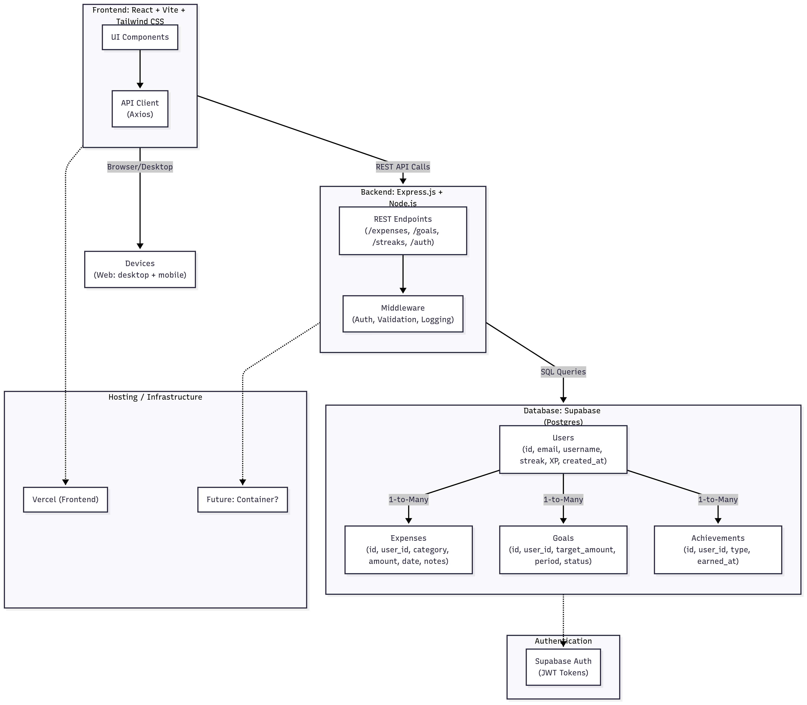

# Architecture

## General Tech Stack

Model: Client-Server Model (frontend + backend that communicates via REST APIs)

Frontend: React (Vite)  
Styling: Tailwind CSS  
Backend: Express.js + Node.js  
Database: Supabase  

## Devices

Web (desktop + mobile browser)

## Database Schemas

Tables:
- Users (id, email, password hash, username, streak, XP, created_at)
- Expenses (id, user_id, category, amount, date, notes)
- Goals (id, user_id, target_amount, period, status)
- Streaks (id, user_id, days)
- Achievements (id, user_id, type, earned_at)

## Authentication & Authorization

Supabase Auth (JWT Tokens)

## Hosting

If we get to it, we will host on Vercel. 

## Architecture Design

